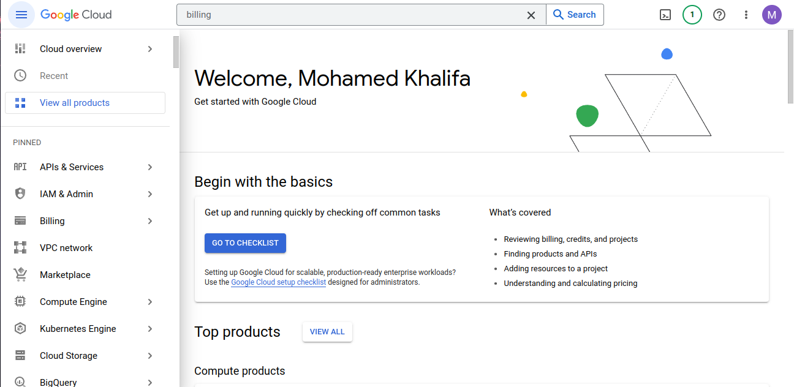
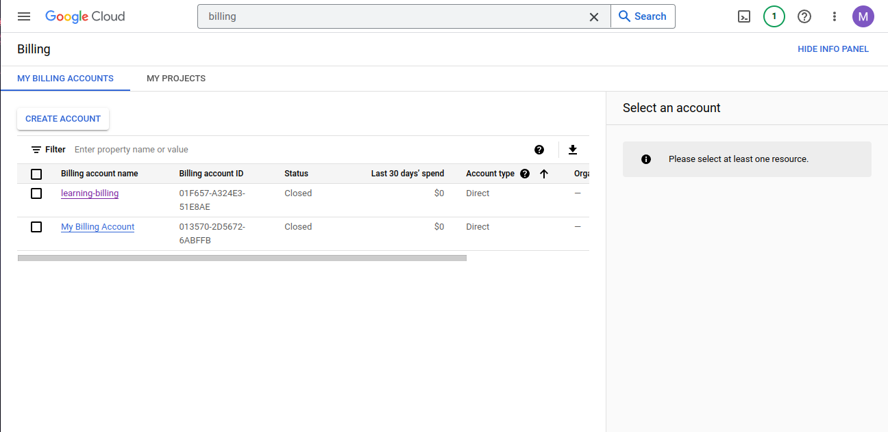
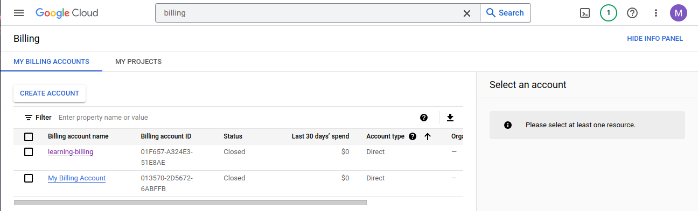
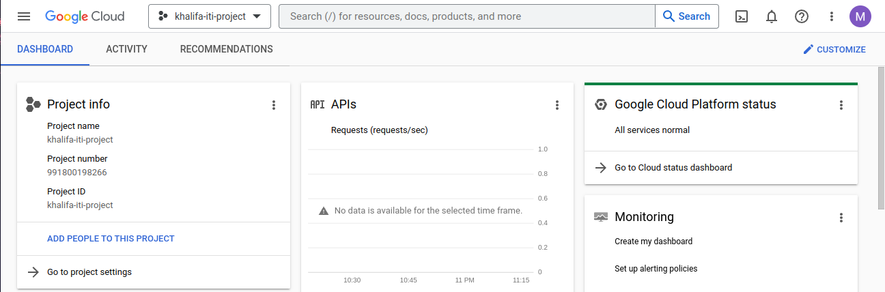

# GCP
## Lab 1.1
--- 
### Q1- Explore google cloud console

---
### Q2- Setup a billing method on your google account

---
### Q3- Create Gcp project

---
### Q4 assign your billing account to your project 

### 5. Setup project budget.

### 6. Setup billing alerts.

### 7. Using cloud shell, list all projects and set default project.
```bash
mohamed_gcp10@cloudshell:~$ gcloud projects list
PROJECT_ID: calm-inkwell-375810
NAME: My First Project
PROJECT_NUMBER: 898558936962

PROJECT_ID: khalifa-iti-project
NAME: khalifa-iti-project
PROJECT_NUMBER: 991800198266
mohamed_gcp10@cloudshell:~$
```git 
### 8. Install and configure gcloud SDK on your pc.

1. Download the Google Cloud SDK package by running the following command
```bash
curl https://sdk.cloud.google.com | bash
```
2. Add the Cloud SDK distribution URI as a package source by running the following command
```bash
echo "deb [signed-by=/usr/share/keyrings/cloud.google.gpg] https://packages.cloud.google.com/apt cloud-sdk main" | sudo tee -a /etc/apt/sources.list.d/google-cloud-sdk.list
```
3. Import the Google Cloud public key by running the following command:
```bash
sudo apt-get install apt-transport-https ca-certificates gnupg
curl https://packages.cloud.google.com/apt/doc/apt-key.gpg | sudo apt-key --keyring /usr/share/keyrings/cloud.google.gpg add -
```
4. Update and install the Cloud SDK by running the following command:
```bash
sudo apt-get update && sudo apt-get install google-cloud-sdk
```
5. to initialize the SDK and set up your credentials.
```bash
gcloud init
```
6. to verfiy the installation of gcloud:
```bash
$ gcloud -v
Google Cloud SDK 414.0.0
alpha 2023.01.13
beta 2023.01.13
bq 2.0.84
bundled-python3-unix 3.9.16
core 2023.01.13
gcloud-crc32c 1.0.0
gsutil 5.18
```
### 9. List all projects using gcloud SDK and set default project
```bash
$ gcloud projects list
PROJECT_ID           NAME                 PROJECT_NUMBER
calm-inkwell-375810  My First Project     898558936962
khalifa-iti-project  khalifa-iti-project  991800198266
```
```bash
$ gcloud config set project khalifa-iti-project
Updated property [core/project].
```
