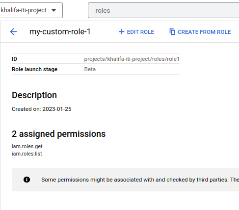
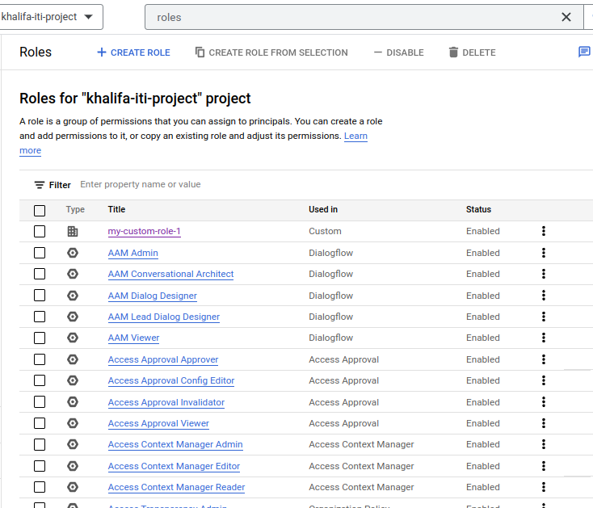
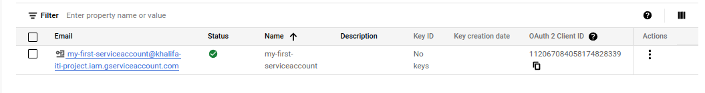
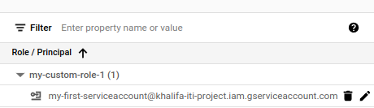
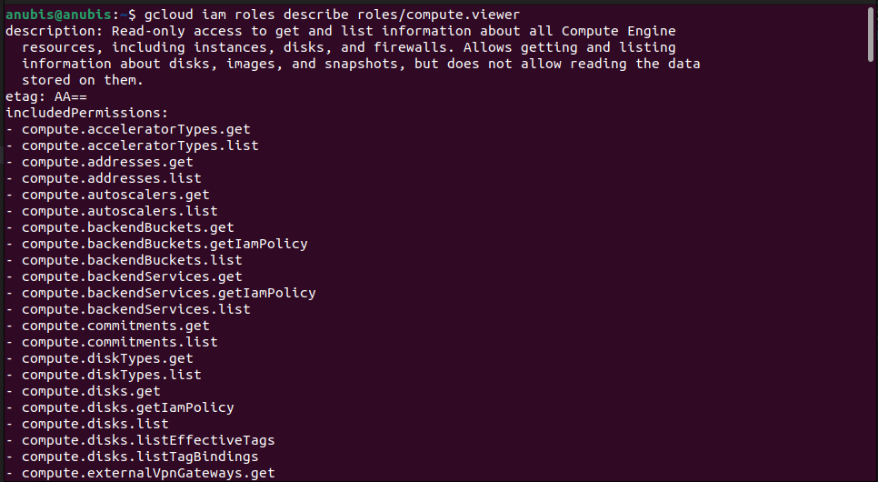
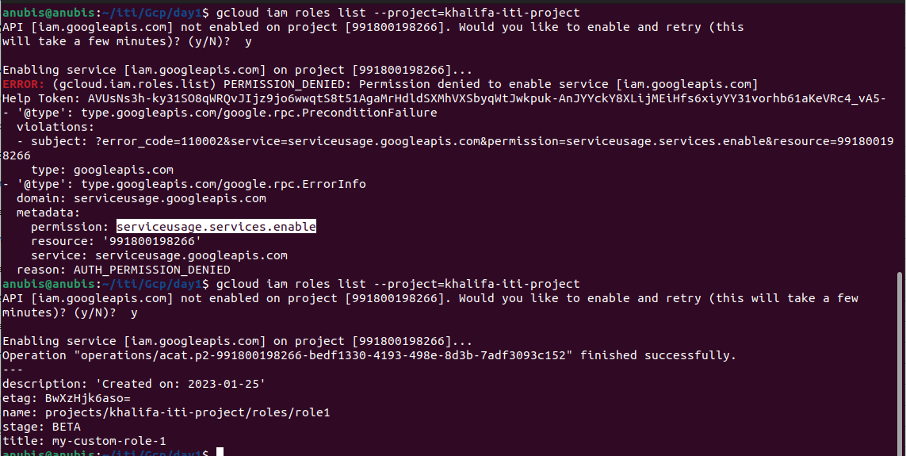

# GCP
## Lab 1.2
--- 
### 1. From Cloud console, do the following:
### I. Create custom role named "my-custom-role-1" with the following permissions only:
#### – Iam.roles.get
#### – Iam.roles.list

### 2. From Cloud console, Explore primitive and pre-defined roles and their permissions.

### 3. From Cloud console, Create a service account with id "my-first-serviceaccount".

### 4. From Cloud console, Assign the custom role "my-custom-role-1" to the service account "my-firstserviceaccount"

### 5. Using gcloud,
#### I. List all roles on your project.
```bash
$ gcloud iam roles list --project=khalifa-iti-project
---
description: 'Created on: 2023-01-25'
etag: BwXzHbVXPOg=
name: projects/khalifa-iti-project/roles/role1
stage: BETA
title: my-custom-role-1
```
#### II. Describe the predefined role "roles/compute.viewer" and view its details & permissions

#### III. Describe the custom role "my-custom-role-1" and view its details & permissions.
```bash
$ gcloud iam roles describe role1 --project=khalifa-iti-project
description: 'Created on: 2023-01-25'
etag: BwXzHbVXPOg=
includedPermissions:
- iam.roles.get
- iam.roles.list
name: projects/khalifa-iti-project/roles/role1
stage: BETA
title: my-custom-role-1
```
#### IV. List all authenticated accounts.
```bash
$ gcloud auth list 
     Credentialed Accounts
ACTIVE  ACCOUNT
*       mohamed.gcp10@gmail.com

To set the active account, run:
    $ gcloud config set account `ACCOUNT`
```
#### V. Activate the service account "my-first-serviceaccount".
```bash
$ gcloud auth activate-service-account --key-file=/home/anubis/iti/Gcp/day1/khalifa-iti-project-c10be37c2c22.json
Activated service account credentials for: [my-first-serviceaccount@khalifa-iti-project.iam.gserviceaccount.com]
```
#### VI. List all authenticated accounts again.
```bash
gcloud auth list
                           Credentialed Accounts
ACTIVE  ACCOUNT
        mohamed.gcp10@gmail.com
*       my-first-serviceaccount@khalifa-iti-project.iam.gserviceaccount.com

To set the active account, run:
    $ gcloud config set account `ACCOUNT`
```
#### VII. Using this service account, try to list all roles on your project.
```bash
gcloud config set account my-first-serviceaccount@khalifa-iti-project.iam.gserviceaccount.com
Updated property [core/account].
```

#### VIII.Try to delete custom role "my-custom-role-1"
```bash
gcloud iam roles delete role1 --project=khalifa-iti-project
deleted: true
description: 'Created on: 2023-01-25'
etag: BwXzHkhPnqQ=
includedPermissions:
- iam.roles.delete
- iam.roles.get
- iam.roles.list
- serviceusage.services.enable
name: projects/khalifa-iti-project/roles/role1
stage: BETA
title: my-custom-role-1
```