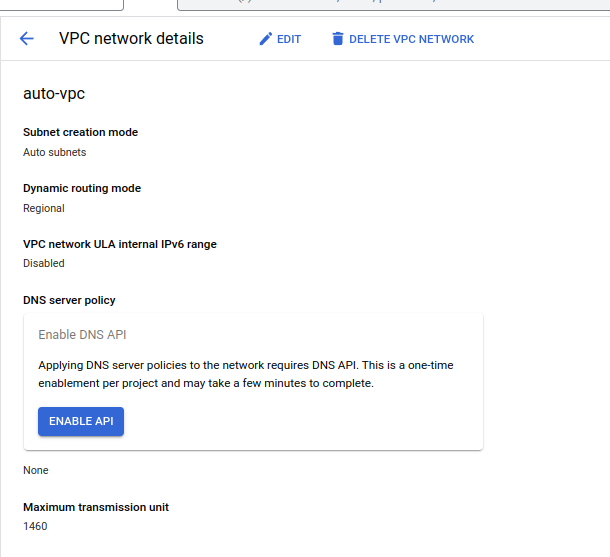
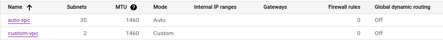
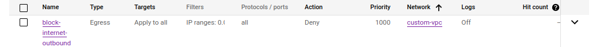
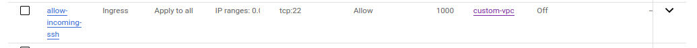
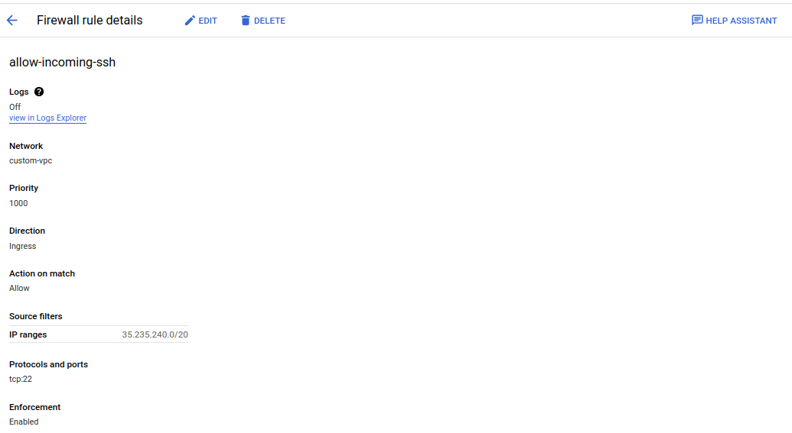

# GCP
## Lab 2.1
--- 
### 1. From Cloud console, create a VPC named “auto-vpc” with auto-mode enabled, How many subnets created?

### 2. From Cloud console, create a VPC named “custom-vpc” with auto-mode disabled and create two subnets.

### 3. Using gcloud tool list all available VPCs and list subnets of each VPC.
```bash
$ gcloud compute networks list --project=khalifa-iti-20233
NAME        SUBNET_MODE  BGP_ROUTING_MODE  IPV4_RANGE  GATEWAY_IPV4
auto-vpc    AUTO         REGIONAL
custom-vpc  CUSTOM       REGIONAL
default     AUTO         REGIONAL
```
### 4. Block internet access from you VPC using firewall rules.

### 5. Create a firewall rule to allow incoming SSH requests from internet to all instances in your vpc.

### 6. Modify the previous firewall rule to allow only ssh requests coming through Google’s IAP servers.
