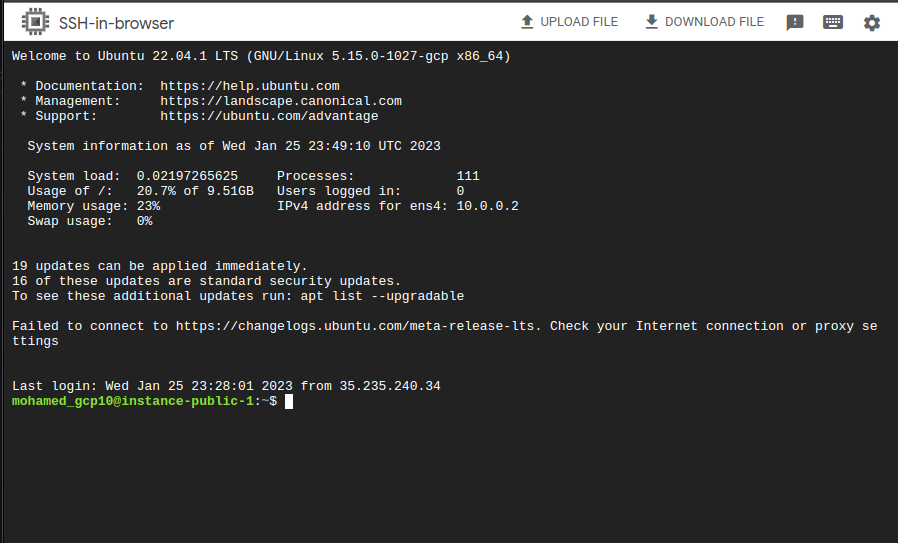
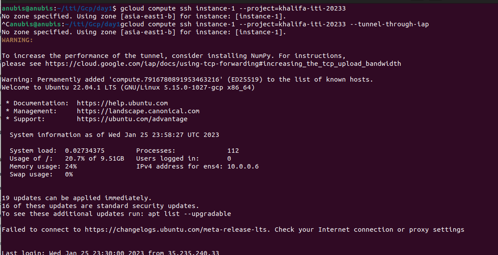
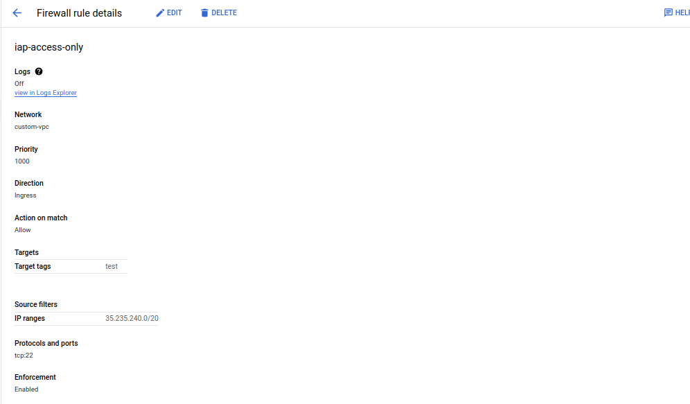
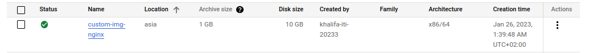
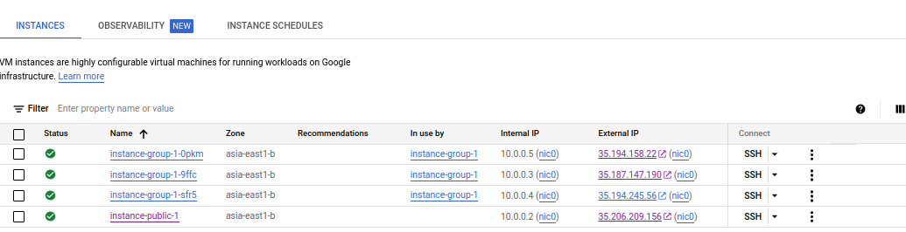
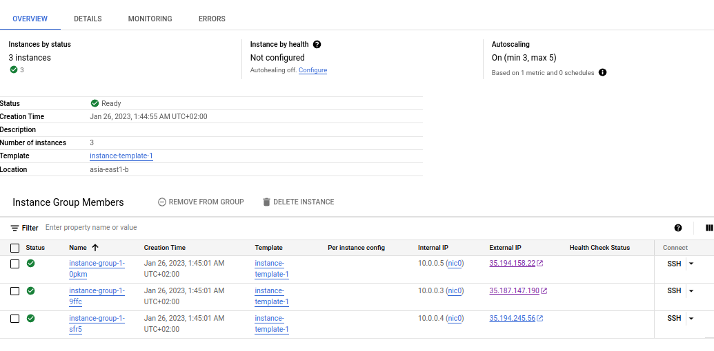

# GCP
## Lab 1.2
--- 
### 1. Create a VM with public ip then:
– In two different ways, SSH into this VM.
```bash
gcloud compute ssh instance-public-1 --project=khalifa-iti-20233 --tunnel-through-iap
```



– Enforce SSH into this VM to be IAP protected.




### 2. Create a VM without public ip then:
– SSH into this vm.
```bash
gcloud compute ssh instance-private-1 --project=khalifa-iti-20233 --tunnel-through-iap
```
– update system packages (is it possible?)
    **answer is no**
---
### 3. Create a VM with public ip then:
– SSH into this vm
– Update system packages.
```bash
sudo apt update
```
– Setup Nginx Web Server and test your setup.
```bash
sudo apt install nginx
```
– Create a custom image from this VM named “custom-img-nginx”.

### 4. Create MIG (min 3 and max 5) of a template using the custom image “custom-img-nginx”.

