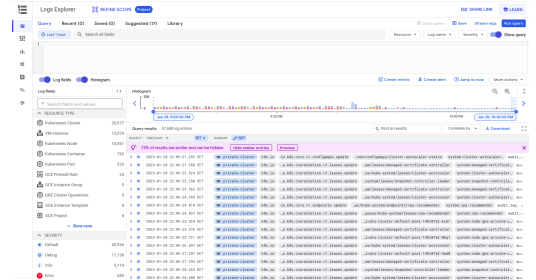
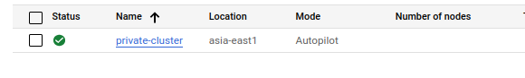

# GCP
## Lab 3.3
--- 
### 1. Create a private GKE cluster.


### 2. Deploy Nginx as a deployment using latest Nginx docker image on Docker Hub.
```bash

gcloud container clusters get-credentials private-cluster --zone asia-east1-a --project khalifa-iti-project

kubectl create deployment nginx --image nginx --replicas=1

```
### 3. Expose your Nginx deployment using Kubernetes LoadBalancer Service.
```bash
kubectl expose deployment nginx --port=80 --target-port=80 --name=lb-service --type=loadBalancer
```
### 4. What is the type of GCP Load Balancer that is created for your LB service?
standard loadbalancer
### 5. Use kubectl to view container logs.
```bash
kubectl logs nginx-8f458gc5s
```
### 6. Use cloud logging service to view container logs. [hint: search about cloud logging service for gke]


### 7. (Bonus) setup a HTTP load balancer for your deployment using the kubernetes ingress resource. (hint: link)

### 8. Create an autopilot GKE cluster with public control plane.


### 9. Enforce the cluster’s control plane to accept only connections from your local machine.
```bash
gcloud container clusters describe private-cluster --region asia-east1 
```

### 10. Install kubectl on local machine and use it to connect to the cluster.
```bash

gcloud container clusters get-credentials private-cluster --zone asia-east1-a --project khalifa-iti-project

kubectl config current-context

```
