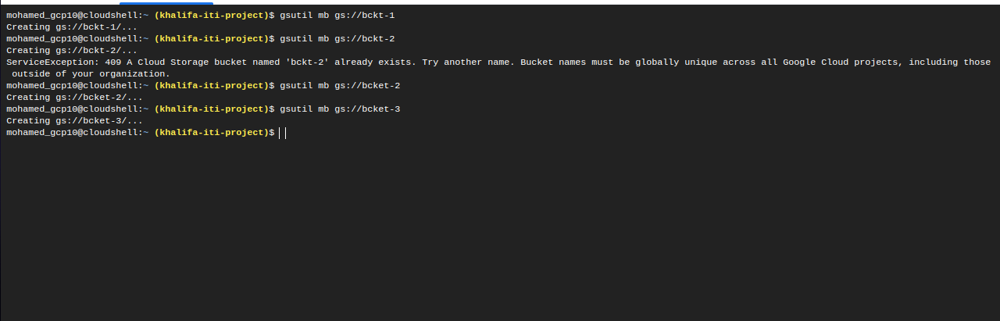
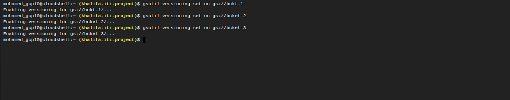
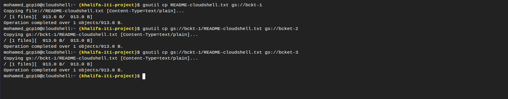
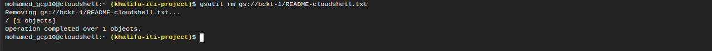
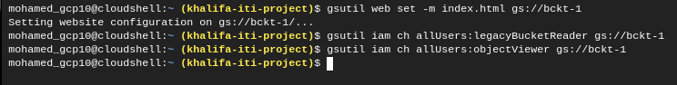
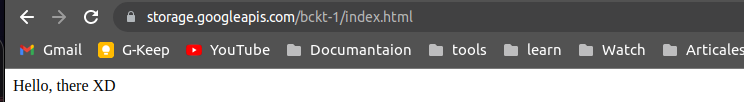

# GCP
## Lab 4.2
--- 
### 1.Using gsutil:
–Create 3 buckets.

–Enable Versioning for them.

–Upload a file into bucket-1 then copy it from bucket-1 into bucket-2 & bucket-3.

–Delete the file from bucket-1

### 2.Host a static website on a standard public GCS bucket [hint: link].

### 3.Deploy MySQL private instance and connect to it then create a new database.

    