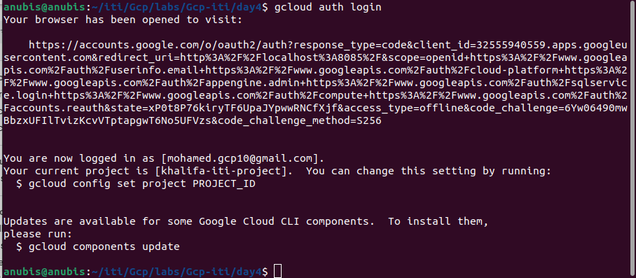

# GCP
## Lab 4.3
--- 
### 1. Using gcloud & Docker:
– Configure Docker & gcloud to work with GCR of your project. [hint: link]

– Push Nginx docker image to GCR (make the image private).

– Pull this image into a k8s setup or on a VM (hint: attach a SA on ur vm or gke with correct iam role).

### 2. Using Cloud Functions:
– Create a Function that runs whenever a file is uploaded to a cloud storage bucket. [hint: link]

### 3. Using Cloud Run:
– Run a pre-built docker image (pulled from GCR) [hint: link]

– Build and Run any sample app [hint: link]

### 4. Using App Engine:
– Run the sample hello-world python app [link]

